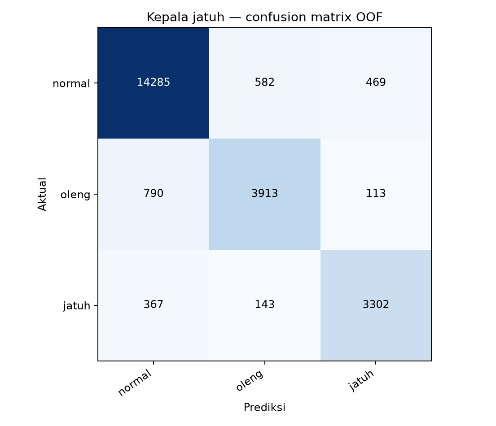
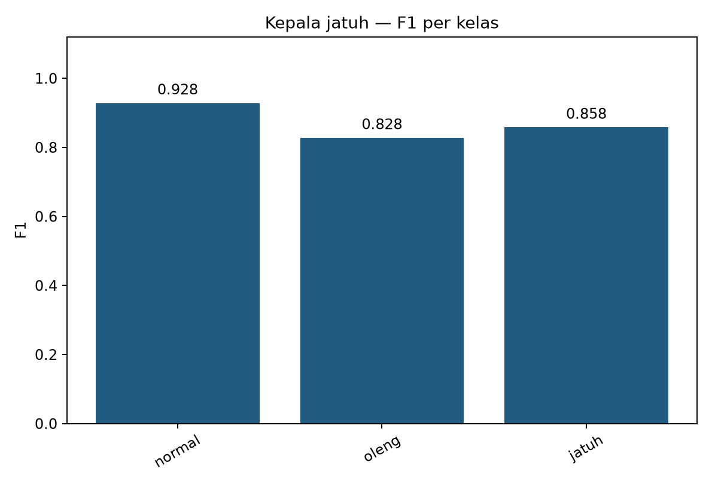
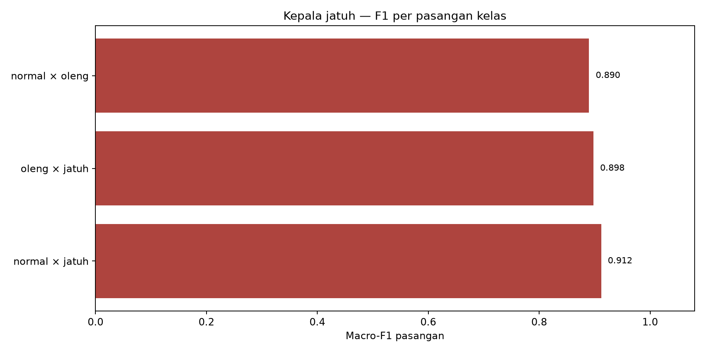
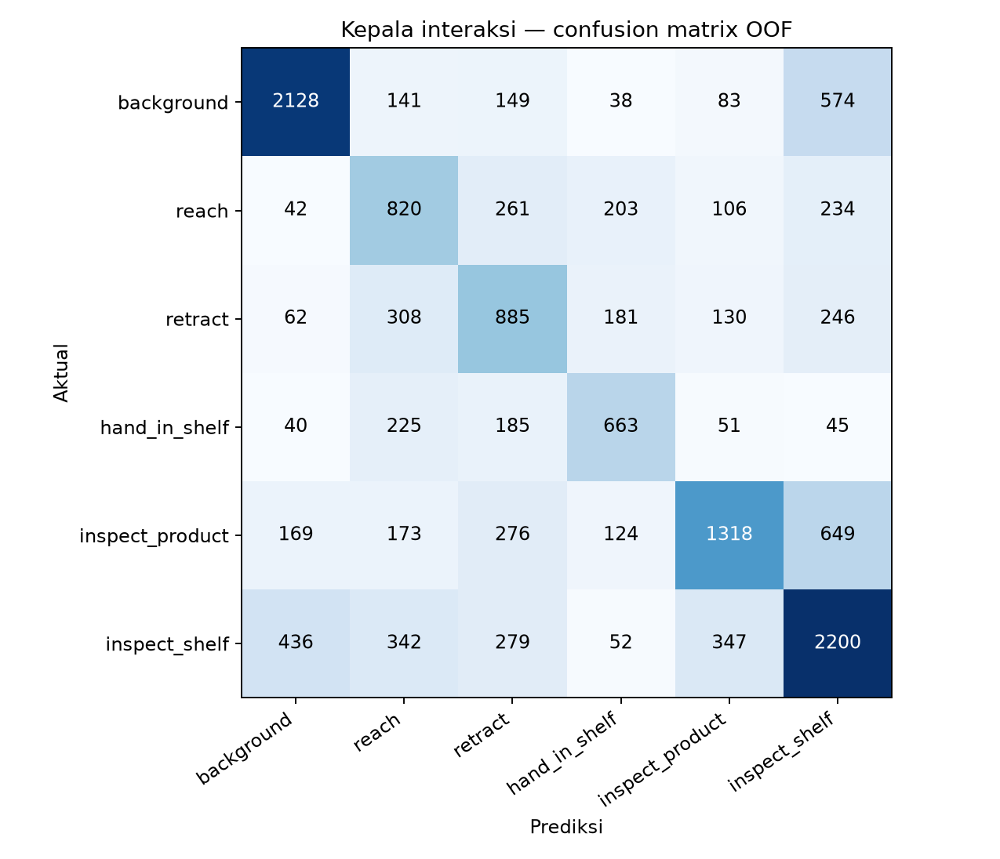
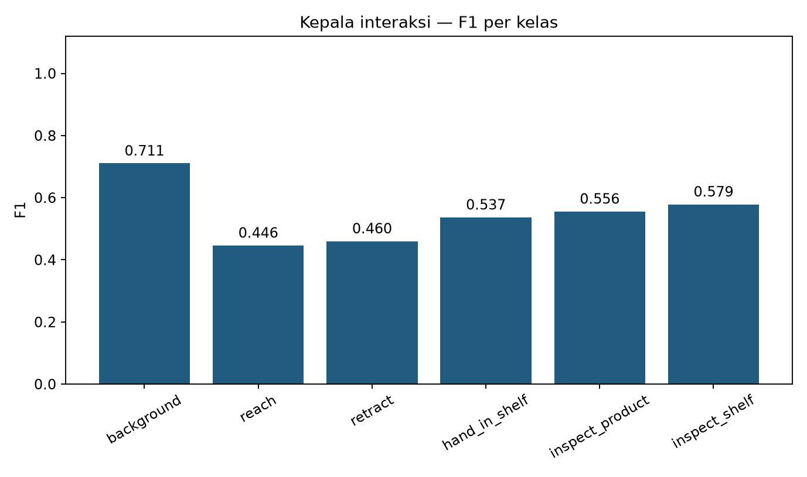
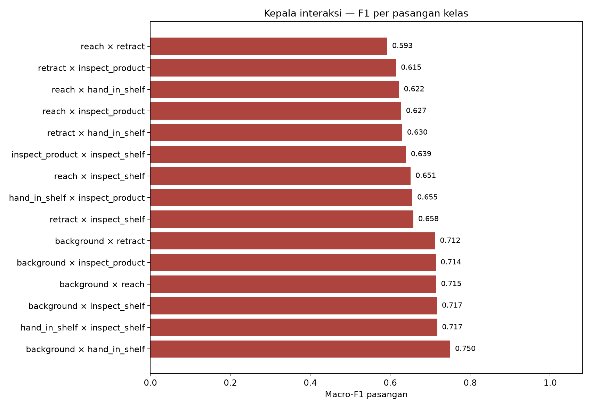

# Baseline OOF agregat — kepala jatuh dan interaksi

Angka dihitung ulang dari confusion matrix OOF agregat di `eval/fall_cv_summary.json` dan `eval/interaction_cv_summary.json`. Data prediksi per sampel dan metadata slice belum tersedia.

## Kepala jatuh

- [Metrik per kelas](fall_per_kelas.csv)
- [F1 per pasangan kelas](fall_f1_per_pasangan.csv)

## Kepala interaksi

- [Metrik per kelas](interaction_per_kelas.csv)
- [F1 per pasangan kelas](interaction_f1_per_pasangan.csv)
- [JSON lengkap](baseline_analisis.json)

Pasangan interaksi terlemah adalah **reach × retract** dengan macro-F1 0.5927. F1 pasangan dihitung pada baris aktual dua kelas terkait. Prediksi ke kelas lain tetap dihitung sebagai kesalahan. Hasil ini tidak dapat dipakai untuk analisis yaw/pitch atau performer karena metadata dan prediksi OOF mentah tidak tersedia.
