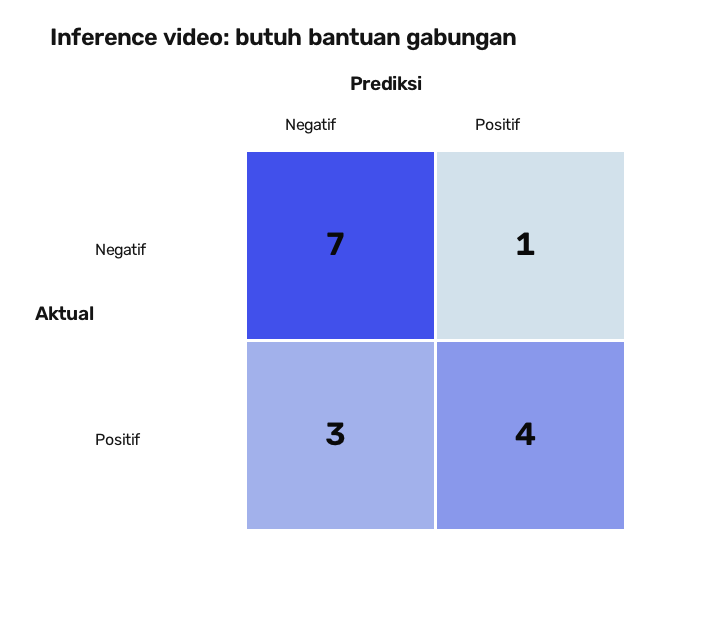
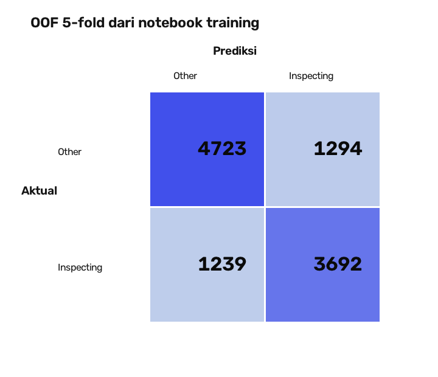
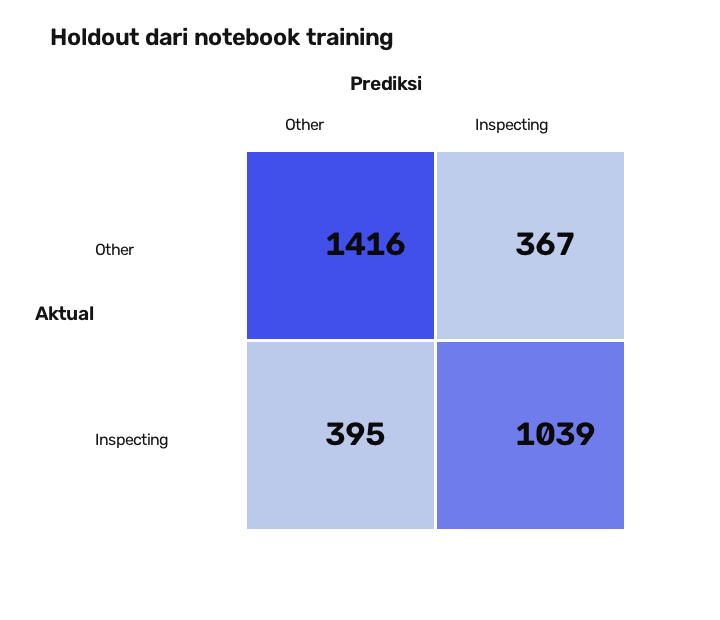

# Evaluasi inference butuh bantuan

Evaluasi ini menjalankan model interaksi yang diberikan pengguna dan aturan angkat tangan dari kode backend saat ini terhadap video di `eval/vidio butuh bantuan/`. Tidak ada threshold model atau arsitektur baru yang ditambahkan.

## Hasil utama

| Target evaluasi | TP | FP | FN | TN | Precision | Recall | F1 |
|---|---:|---:|---:|---:|---:|---:|---:|
| Inspecting (hanya video berlabel subtype) | 0 | 0 | 2 | 8 | N/A | 0.0% | 0.0% |
| Angkat tangan (hanya video berlabel subtype) | 1 | 1 | 1 | 7 | 50.0% | 50.0% | 50.0% |
| Butuh bantuan gabungan | 4 | 1 | 3 | 7 | 80.0% | 57.1% | 66.7% |
| Gabungan, isi video unik | 2 | 1 | 3 | 7 | 66.7% | 40.0% | 50.0% |

Ada 15 nama file dan 13 isi video unik. `vidio1.mp4`, `vidio2.mp4`, dan `vidio3.mp4` memiliki hash yang sama persis. Ketiganya terdeteksi positif melalui angkat tangan, tetapi tidak boleh dianggap sebagai tiga sampel independen.



## Hasil per video

| Video | Label | Inspecting | Angkat tangan | Gabungan | Status gabungan |
|---|---|---:|---:|---:|---:|
| Jason (ambil langsung 2).mp4 | negative | Tidak | Tidak | Tidak | BENAR |
| Jason (ambil langsung).mp4 | negative | Tidak | Tidak | Tidak | BENAR |
| Jason (angkat tangan).mp4 | angkat_tangan | Tidak | Ya | Ya | BENAR |
| Jason (bingung).mp4 | inspecting | Tidak | Tidak | Tidak | SALAH |
| Jason (streching 1).mp4 | negative | Tidak | Tidak | Tidak | BENAR |
| Jason (streching 2).mp4 | negative | Tidak | Tidak | Tidak | BENAR |
| Mama (angkat tangan).mp4 | angkat_tangan | Tidak | Tidak | Tidak | SALAH |
| Mama (bingung).mp4 | inspecting | Tidak | Tidak | Tidak | SALAH |
| Mama (langsung ambil).mp4 | negative | Tidak | Ya | Ya | SALAH |
| Mama (streching).mp4 | negative | Tidak | Tidak | Tidak | BENAR |
| put(normal).mp4 | negative | Tidak | Tidak | Tidak | BENAR |
| take(normal).mp4 | negative | Tidak | Tidak | Tidak | BENAR |
| vidio1.mp4 | butuh_bantuan | Tidak | Ya | Ya | BENAR |
| vidio2.mp4 | butuh_bantuan | Tidak | Ya | Ya | BENAR |
| vidio3.mp4 | butuh_bantuan | Tidak | Ya | Ya | BENAR |

Data lengkap tersedia di [`reports/hasil_per_video.csv`](reports/hasil_per_video.csv). Bukti frame setiap video berada di [`reports/frames/`](reports/frames/), sedangkan bukti mentah run berada di [`runs/20260926T095615809164Z/evidence.json`](runs/20260926T095615809164Z/evidence.json) dan [`execution.log`](runs/20260926T095615809164Z/execution.log).

## Model dan logika inference

- Model interaksi mengikuti notebook: 17 keypoint x 3 fitur = 51 input, BiLSTM dua arah dengan hidden size 128 dan 2 layer, mean pooling, LayerNorm(256), dropout 0.3, lalu linear 2 kelas (`other`, `inspecting`).
- Bobot [`models/interaction2_head.pt`](models/interaction2_head.pt) mempunyai SHA-256 `600a4ce58e663bcf61a81a2b921c3bd22e02061636f59a4a355a2bfdea7b49b6` dan identik dengan `backend/models/interaction_head.pt`.
- Keputusan kelas model memakai `argmax(softmax(logits))`, sama seperti notebook. Pipeline video memakai jendela 45 frame pada 15 FPS dan stride 15 dari kode proyek.
- Event `butuh_bantuan` baru dibentuk setelah **2 window inspecting aktif berturut-turut** (`help_min_win=2`), sama dengan konfigurasi aktual `backend/app.py`. Prediksi kelas model dan event akhir karena itu dicatat sebagai dua tahap yang berbeda.
- Angkat tangan memakai aturan geometri dan nilai default dari `backend/pipeline/gestures.py` milik perubahan teman.
- Prediksi gabungan bernilai positif jika pipeline menghasilkan event `butuh_bantuan` atau `angkat_tangan`.

Konfigurasi run direkam di [`evidence.json`](runs/20260926T095615809164Z/evidence.json). Pengaturan yang diberikan evaluator hanya mengaktifkan interaksi dan gesture, menonaktifkan fall, serta memilih kelas inspecting; evaluator tidak menambahkan threshold probabilitas baru.

## Rumus

- Precision = TP / (TP + FP)
- Recall = TP / (TP + FN)
- F1 = 2 x Precision x Recall / (Precision + Recall)
- Confusion matrix disusun sebagai `[[TN, FP], [FN, TP]]`, dengan baris sebagai label aktual dan kolom sebagai prediksi.

Jika tidak ada satu pun prediksi positif, precision ditulis `N/A` karena penyebutnya nol. F1 tetap 0 ketika recall 0.

## Bukti hasil training dari notebook

Notebook melaporkan OOF 5-fold sebanyak 10,948 window: macro-F1 0.7676 dan recall inspecting 0.749. Holdout sebanyak 3,217 window: accuracy 0.763, macro-F1 0.760, dan recall inspecting 0.725.





Angka training di atas disalin dari output notebook, bukan dihitung ulang karena dataset training/OOF tidak disertakan. File sumber disimpan di [`source/`](source/).

## Kelemahan yang terlihat

- Pada run mode `both`, kedua video inspecting (`Jason (bingung)` dan `Mama (bingung)`) tidak menjadi event karena window yang diprediksi inspecting tidak sekaligus memenuhi rangkaian dua window aktif dan pemeriksaan dwell. [Uji diagnosis mode `rak`](reports/diagnosis_bingung.json) menunjukkan `Jason (bingung)` membentuk event, sedangkan `Mama (bingung)` tetap gagal karena tracking memecah prediksi positif menjadi track yang masing-masing hanya memiliki satu window. Model Mama tetap pernah memilih inspecting dengan probabilitas 0,983; kegagalannya berada pada agregasi event, bukan ketiadaan prediksi inspecting.
- `Mama (angkat tangan)` tidak terdeteksi, sedangkan `Mama (langsung ambil)` salah terdeteksi sebagai angkat tangan. Ini menunjukkan aturan geometri masih sensitif terhadap pose tangan yang mirip.
- Beberapa video pendek atau track terfragmentasi menghasilkan sangat sedikit window; `take(normal).mp4` bahkan tidak menghasilkan track valid. Kondisi ini membatasi keputusan model temporal.
- Tiga video bernama `vidio1/2/3` identik secara byte sehingga tidak menambah keragaman evaluasi. Untuk hasil lebih kuat, ganti dua salinan dengan rekaman berbeda.
- Sampel subtype hanya 2 positif per subtype. Metrik mudah berubah besar hanya karena satu video, sehingga belum cukup untuk menyimpulkan performa umum.

## Menjalankan ulang

Jalankan dari root repository:

```bash
backend/.venv/bin/python eval/hasilevaluasibutuhbantuan/tools/evaluate.py
backend/.venv/bin/python eval/hasilevaluasibutuhbantuan/tools/build_report.py
```

Evaluator membaca label dari [`labels/video_labels.csv`](labels/video_labels.csv), memeriksa setiap file berlabel tersedia, menyimpan hash artefak, dan membuat run baru tanpa menimpa bukti run sebelumnya.
