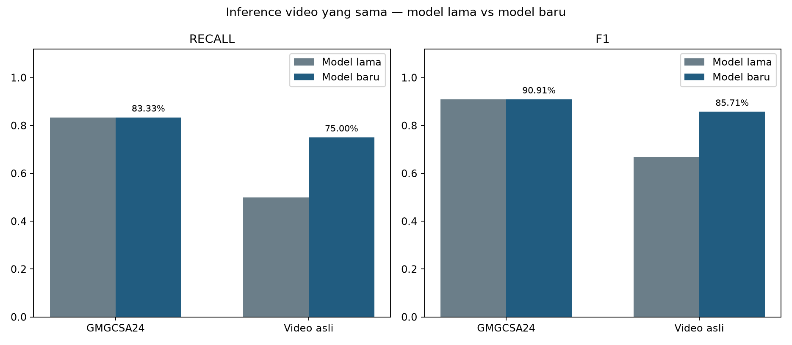
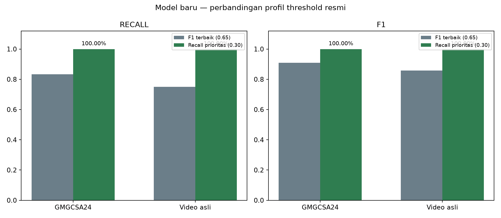

# SAPA — inference model fall baru

Evaluasi ini terpisah dari `eval/infrence fall/`; model dan laporan lama tidak dihapus atau diubah.

- **GMGCSA24:** 5 dari 6 video terdeteksi; recall 83.33%; F1 90.91%.
- **Video asli:** 3 dari 4 video terdeteksi; recall 75.00%; F1 85.71%.

Semua klip berlabel positif jatuh. Precision 100% belum menguji alarm palsu karena tidak ada video negatif; specificity, false-positive rate, balanced accuracy, dan ROC-AUC tidak dapat dihitung dari kumpulan ini.



## Perbandingan terhadap inference lama

- GMGCSA24 recall: 83.33% → 83.33% (+0.00%)
- GMGCSA24 f1: 90.91% → 90.91% (+0.00%)
- Video asli recall: 50.00% → 75.00% (+25.00%)
- Video asli f1: 66.67% → 85.71% (+19.05%)

## Konsistensi profil threshold model baru



- GMGCSA24 recall: 83.33% → 100.00% (+16.67%)
- GMGCSA24 f1: 90.91% → 100.00% (+9.09%)
- Video asli recall: 75.00% → 100.00% (+25.00%)
- Video asli f1: 85.71% → 100.00% (+14.29%)

Profil aktif adalah **F1_terbaik** dari `threshold_best_models.json` yang diberikan. Eksekusi default mengambil nama dan nilai `threshold_recommended` langsung dari `fall_head.json`; kandidat lain hanya dapat dipilih secara eksplisit melalui argumen `--candidate`.

## Navigasi

- [Evaluasi training OOF](reports/training_oof/README.md)
- [Laporan GMGCSA24](reports/gmgcsa24/README.md)
- [Laporan video asli](reports/vidio_asli/README.md)
- [Analisis per-irisan video](reports/SLICE.md)
- [Perbandingan CSV](reports/comparison_old_vs_new.csv)
- [Perbandingan profil threshold](reports/comparison_threshold_profiles.csv)
- [Bukti reproducibility](reproducibility/verification.json)
- [Kode training asli yang diberikan](source/new_train_now.py)
- [Audit kesesuaian kode dan artefak](SOURCE_ALIGNMENT.md)
- [Perubahan model AI dan logika inferensi](MODEL_AND_INFERENCE_CHANGES.md)

## Konfigurasi deployment yang diuji

Target 15 FPS, window 45, stride 15, probabilitas jatuh ≥ 0.65, sudut torso maksimum ≥ 5.0°, dan kecepatan torso ≥ 0.0. Geometri dihitung dari pose ternormalisasi sesuai kode training. Karena `T_speed=0`, syarat kecepatan tidak menyaring jendela pada profil aktif. Pada OOF training, profil aktif melaporkan recall 83.55%, precision 88.25%, F1 85.84%, dan false-alarm rate 2.10%.

## Rumus metrik

- `Precision = TP / (TP + FP)`
- `Recall = TP / (TP + FN)`
- `F1 = 2TP / (2TP + FP + FN)`
- `Accuracy = (TP + TN) / (TP + TN + FP + FN)`
- `Specificity = TN / (TN + FP)`
- `False-positive rate = FP / (FP + TN)`
- `Balanced accuracy = (Recall + Specificity) / 2`
- `Macro-F1 = rata-rata F1 semua kelas`

Penyebut nol dilaporkan sebagai `N/A`, bukan diganti dengan nol. Pada evaluasi video positif saja, accuracy sama dengan recall dan tidak menggambarkan performa umum.

Confusion matrix OOF training berisi 89865 jendela dengan akurasi agregat 89.40% dan macro-F1 86.83%. Angka OOF dan inference video tidak dibandingkan sebagai unit yang setara.

## Reproduksi

```bash
backend/.venv/bin/python "eval/inference new train fall/scripts/run_all.py"
```

```bash
backend/.venv/bin/python -m unittest discover -s "eval/inference new train fall/tests" -v
```

Cuplikan PNG berasal dari video sumber. Bukti itu menunjukkan input dan keputusan per klip, bukan anotasi waktu jatuh yang lengkap.
