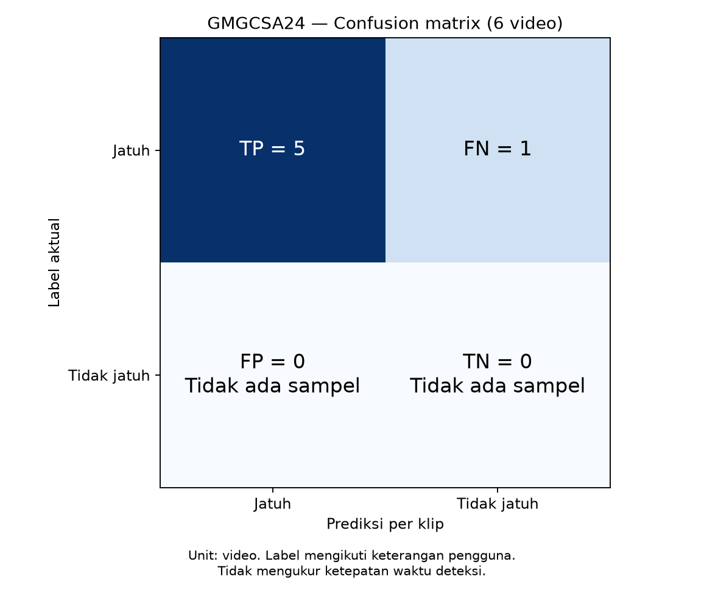
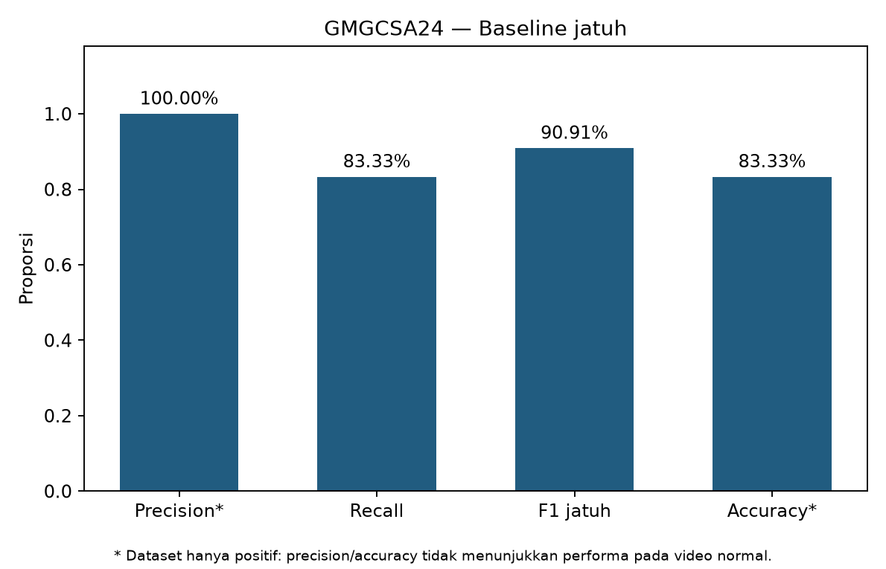
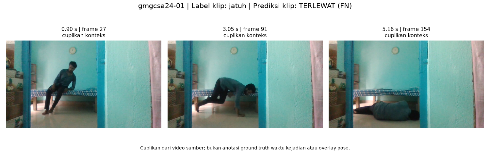
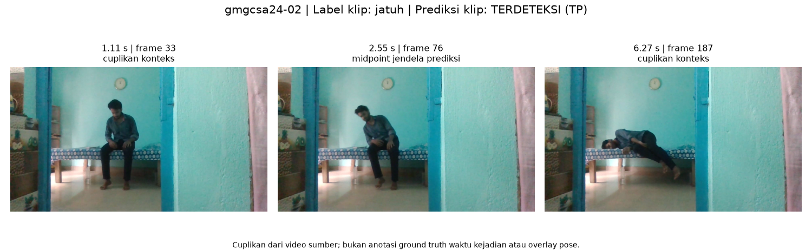
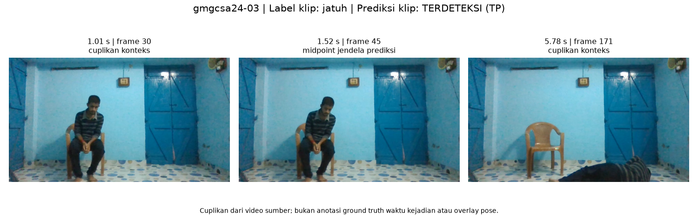
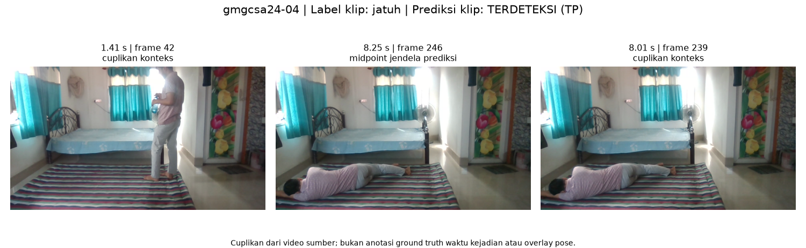
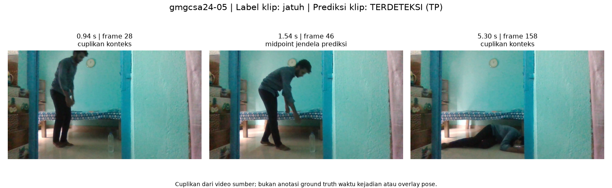
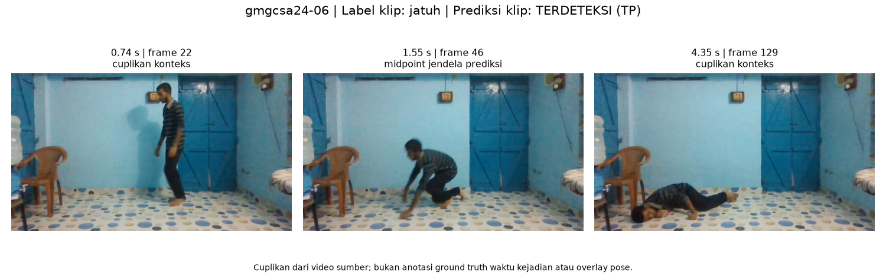

# Baseline jatuh — GMGCSA24

Evaluasi keberadaan jatuh per video. Label positif diberikan pengguna; belum ada anotasi waktu kejadian.

| Metrik | Hasil |
| --- | --- |
| precision | 100.00% |
| recall | 83.33% |
| f1 | 90.91% |
| accuracy | 83.33% |
| specificity | N/A |
| false_positive_rate | N/A |
| balanced_accuracy | N/A |

TP=5, FN=1, FP=0, TN=0. **Tidak ada video negatif.** FP/TN nol berarti belum diuji; precision 100% bukan bukti tidak ada alarm palsu. N/A berarti tidak dapat dihitung.

## Hasil per video

| ID | File | Hasil |
| --- | --- | --- |
| gmgcsa24-01 | Falling (LS) on the bed from sitting on the bed then falling (RS) to the floor.mp4 | FN |
| gmgcsa24-02 | Falling (RS) on the bed from sitting on the bed.mp4 | TP |
| gmgcsa24-03 | Falling from sitting on the chair to the ground. Left side Fall. Full body not visible.mp4 | TP |
| gmgcsa24-04 | Standing then falling sideways.mp4 | TP |
| gmgcsa24-05 | Walking then falling (LS) on the floor.mp4 | TP |
| gmgcsa24-06 | Walking to falling. Right side fall.mp4 | TP |

## Bukti visual

Cuplikan bersumber dari video asli. Titik tengah jendela prediksi ditampilkan untuk klip positif; gambar tidak membuktikan akurasi waktu deteksi.

### gmgcsa24-01 — FN

Falling (LS) on the bed from sitting on the bed then falling (RS) to the floor.mp4

### gmgcsa24-02 — TP

Falling (RS) on the bed from sitting on the bed.mp4

### gmgcsa24-03 — TP

Falling from sitting on the chair to the ground. Left side Fall. Full body not visible.mp4

### gmgcsa24-04 — TP

Standing then falling sideways.mp4

### gmgcsa24-05 — TP

Walking then falling (LS) on the floor.mp4

### gmgcsa24-06 — TP

Walking to falling. Right side fall.mp4

## Bukti eksekusi

- [Evidence JSON](../../runs/gmgcsa24/20260926T092346281396Z/evidence.json)
- [Log](../../runs/gmgcsa24/20260926T092346281396Z/execution.log)
- [Metrik JSON](metrics.json)
- [CSV per video](per_video.csv)
