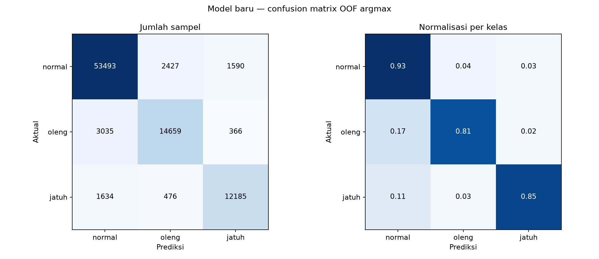

# Evaluasi training OOF — model baru

Angka berasal langsung dari `training_artifacts/fall_cv_summary.json`; ini bukan hasil inference video.

| Kelas | Support | Precision | Recall | F1 |
| --- | --- | --- | --- | --- |
| normal | 57510 | 91.97% | 93.02% | 92.49% |
| oleng | 18060 | 83.47% | 81.17% | 82.30% |
| jatuh | 14295 | 86.17% | 85.24% | 85.70% |

Akurasi agregat: **89.40%**. Macro-F1 dari matriks agregat: **86.83%**.

Threshold rekomendasi artefak: `prob >= 0.65`, `angle >= 5.0`, `speed >= 0.0`. OOF biner yang dilaporkan: recall 83.55%, precision 88.25%, F1 85.84%, false-alarm rate 2.10%.

[Semua kandidat threshold](threshold_candidates.csv) · [Metrik JSON](metrics.json) · [Metrik per kelas](per_class.csv)
