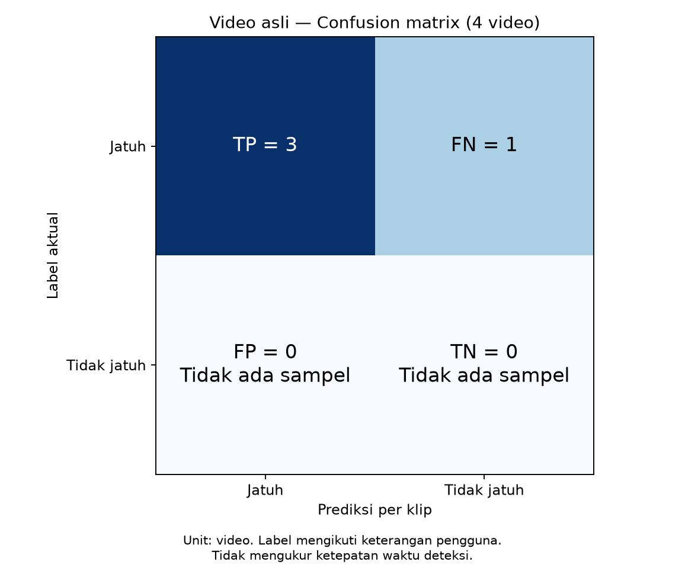
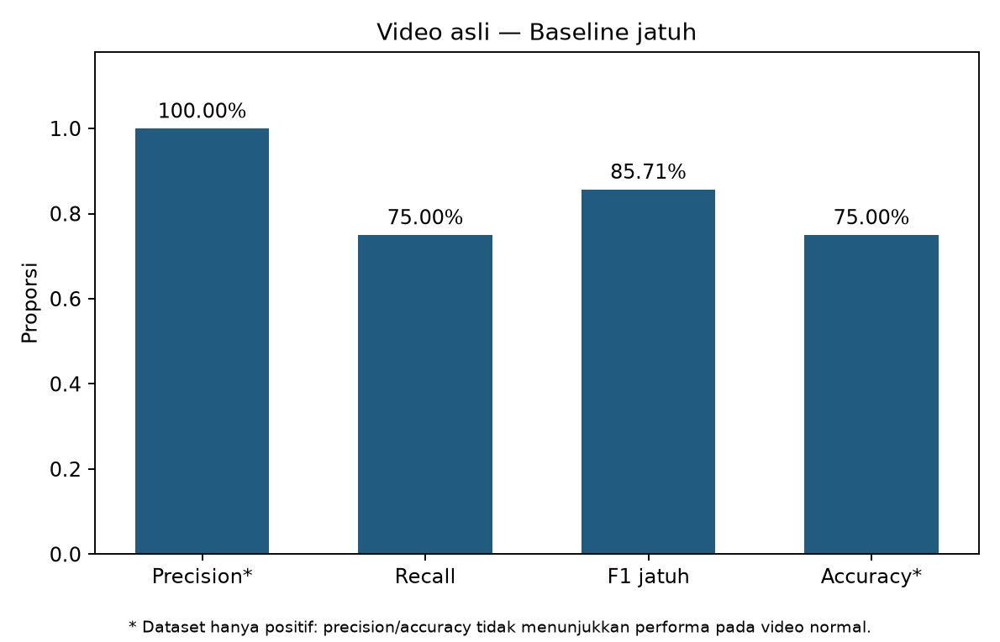
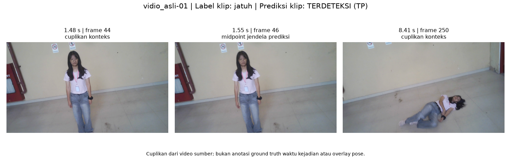
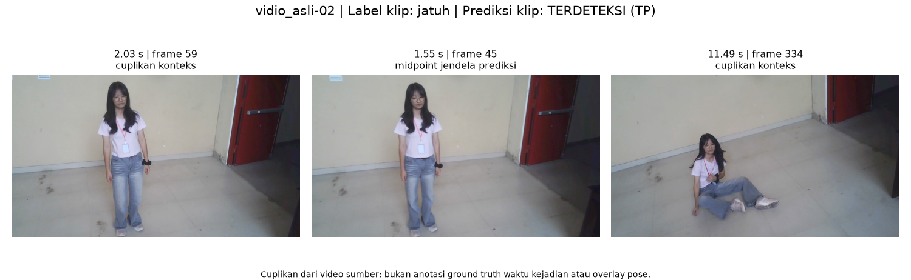
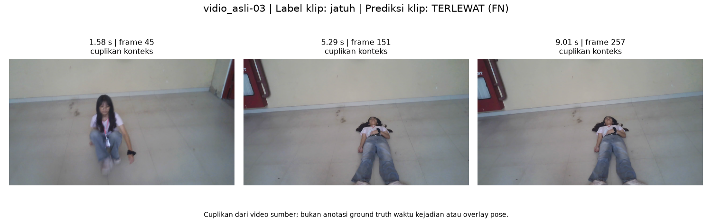
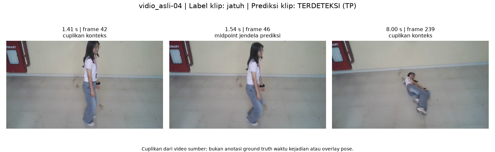

# Baseline jatuh — Video asli

Evaluasi keberadaan jatuh per video. Label positif diberikan pengguna; belum ada anotasi waktu kejadian.

| Metrik | Hasil |
| --- | --- |
| precision | 100.00% |
| recall | 75.00% |
| f1 | 85.71% |
| accuracy | 75.00% |
| specificity | N/A |
| false_positive_rate | N/A |
| balanced_accuracy | N/A |

TP=3, FN=1, FP=0, TN=0. **Tidak ada video negatif.** FP/TN nol berarti belum diuji; precision 100% bukan bukti tidak ada alarm palsu. N/A berarti tidak dapat dihitung.

## Hasil per video

| ID | File | Hasil |
| --- | --- | --- |
| vidio_asli-01 | fall.mp4 | TP |
| vidio_asli-02 | fall1.mp4 | TP |
| vidio_asli-03 | fall2.mp4 | FN |
| vidio_asli-04 | fall3.mp4 | TP |

## Bukti visual

Cuplikan bersumber dari video asli. Titik tengah jendela prediksi ditampilkan untuk klip positif; gambar tidak membuktikan akurasi waktu deteksi.

### vidio_asli-01 — TP

fall.mp4

### vidio_asli-02 — TP

fall1.mp4

### vidio_asli-03 — FN

fall2.mp4

### vidio_asli-04 — TP

fall3.mp4

## Bukti eksekusi

- [Evidence JSON](../../runs/vidio_asli/20260926T092419921987Z/evidence.json)
- [Log](../../runs/vidio_asli/20260926T092419921987Z/execution.log)
- [Metrik JSON](metrics.json)
- [CSV per video](per_video.csv)
