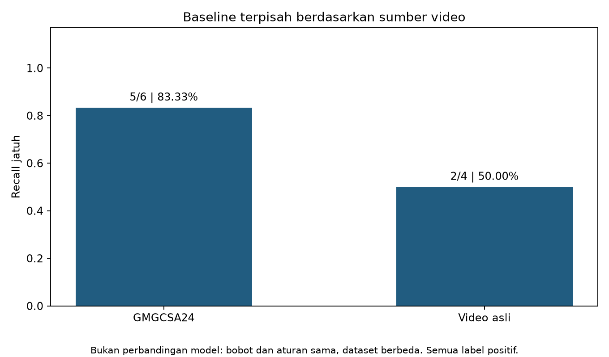
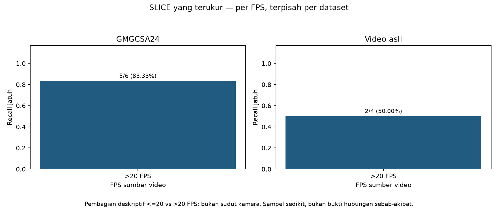

# Analisis per-irisan data (SLICE)

Irisan dihitung dari metadata video yang terukur, tanpa mengubah model. Hasil dipisahkan per dataset untuk menghindari pencampuran sumber.

| Dataset | Irisan | Nilai | N positif | TP | FN | Recall |
| --- | --- | --- | --- | --- | --- | --- |
| gmgcsa24 | dataset | gmgcsa24 | 6 | 5 | 1 | 83.33% |
| gmgcsa24 | resolution | 1280x720 | 6 | 5 | 1 | 83.33% |
| gmgcsa24 | fps_bin | >20 FPS | 6 | 5 | 1 | 83.33% |
| gmgcsa24 | duration_bin | <10 s | 6 | 5 | 1 | 83.33% |
| vidio_asli | dataset | vidio_asli | 4 | 2 | 2 | 50.00% |
| vidio_asli | resolution | 1920x1080 | 4 | 2 | 2 | 50.00% |
| vidio_asli | fps_bin | >20 FPS | 4 | 2 | 2 | 50.00% |
| vidio_asli | duration_bin | <10 s | 2 | 1 | 1 | 50.00% |
| vidio_asli | duration_bin | >=10 s | 2 | 1 | 1 | 50.00% |

## Status irisan yang diminta

- **yaw/pitch kamera dan kombinasi yaw x pitch — unavailable**: Tidak ada metadata sudut atau NPZ augmentasi; arah jatuh pada nama file bukan sudut kamera.
- **performer — unavailable**: Tidak ada ID subjek yang terverifikasi; tidak menebak identitas dari wajah/pakaian.
- **F1 interaksi per pasangan kelas — available_aggregate**: Dihitung dari confusion matrix OOF agregat; prediksi ke kelas di luar pasangan tetap dihitung sebagai kesalahan. [Artefak](../../hasil/interaction_f1_per_pasangan.csv)

Hipotesis bahwa yaw ekstrem menurunkan recall **belum diuji**. Dua belas/15 kombinasi augmentasi tidak boleh direkonstruksi dari nama file atau contoh video. Temuan dataset kecil ini bersifat deskriptif; FPS, resolusi, subjek, dan jenis gerakan bisa saling terkait. Tidak ada uji signifikansi atau klaim generalisasi.
